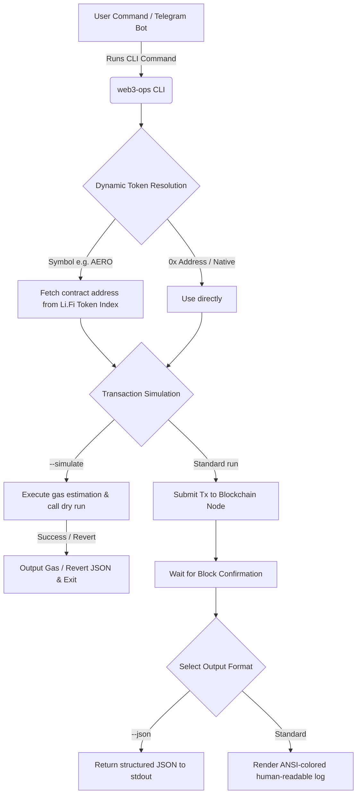

# OpenClaw Web3 Operations Skill

[](https://opensource.org/licenses/MIT)
[](https://nodejs.org/)
[](https://docs.ethers.org/)
[](#)

A production-grade, state-of-the-art Web3 Agent Skill package built with Node.js and Ethers.js v6. Designed to execute EVM transactions, same-chain swaps, cross-chain bridges, NFT mints, and wallet portfolio checks. It can be run as a standalone CLI tool or integrated directly as a plugin/skill for AI agents (such as the **OpenClaw Telegram Bot**).

---

## 🌟 Key Features

*   **🔍 Dynamic Token Resolution**: No more looking up contract addresses. Enter symbols like `USDC`, `AERO`, or `PEPE` directly—the tool dynamically resolves them to their correct contract addresses on-the-fly via the Li.Fi indexer.
*   **💼 Smart Portfolio Scan (`portfolio`)**: Automatically scans the wallet's transaction history via block explorer APIs (Etherscan, Basescan, etc.) to discover all active tokens with a balance (`balance > 0`). Perfect for tracking meme/degen coins automatically.
*   **📋 Click-to-Copy Contract Addresses (CA)**: Lists contract addresses alongside token symbols. When combined with `--json`, it allows Telegram bots to format them inside backticks (e.g., `` `0x...` ``) for click-to-copy convenience.
*   **🧪 Transaction Simulation (`--simulate`)**: Performs a off-chain dry run using `estimateGas` and EVM simulation before broadcasting. Avoid wasted gas fees on reverting transactions!
*   **🔀 Multi-Bridge & Swap Routing**: Supports automatic best-route discovery via **Li.Fi Aggregator**, or manual routes via **Relay.link** (ultra-fast bridging), **Uniswap V3**, and **PancakeSwap V3**.
*   **🤖 AI Agent Friendly (`--json`)**: Appending `--json` silences all human-oriented logs and returns clean, structured JSON to `stdout` for reliable agent parsing.
*   **🌐 Broad Network Support**: Pre-configured support for Ethereum, Arbitrum, Base, Optimism, Polygon, BNB Chain, Avalanche, Linea, Scroll, zkSync, **Sonic (Mainnet)**, and **Berachain (Testnet)**, plus Sepolia and Base Sepolia testnets.
*   **⚡ RPC & Node Customization (`--rpc`)**: Override default public RPC nodes with custom private RPCs or testnet nodes dynamically on a per-command basis.
*   **🎨 Premium Terminal UI**: Outputs colored, readable CLI logs using ANSI color coding (without bloated third-party styling packages).

---

## 📐 Architecture Workflow

This diagram shows how a transaction flows from the CLI command (or Telegram user request) to its on-chain execution:



---

## 🚀 Quick Start

### 1. Installation

Clone this repository and install the dependencies:

```bash
git clone https://github.com/perasyudha/skill-web3.git
cd skill-web3
npm install
```

### 2. Wallet Configuration

Copy `.env.example` to `.env` and configure your credentials:

```bash
cp .env.example .env
```

Open `.env` and fill in your private key or seed phrase:

```env
PRIVATE_KEY="0x..."
# Or use mnemonic:
# MNEMONIC="word1 word2 ... word12"

# Block Explorer API Keys (Highly Recommended for Portfolio Auto-detection)
BASESCAN_API_KEY="your_basescan_key"
ETHERSCAN_API_KEY="your_etherscan_key"
ARBISCAN_API_KEY="your_arbiscan_key"
```

---

## 💻 CLI Commands & Examples

### Get Wallet Address
Find out which wallet address is currently configured in the environment:
```bash
node index.js address
```

### Check Native/Token Balances
Check native coin balance on Arbitrum:
```bash
node index.js balance --chain arbitrum
```

Check a specific ERC-20 token (AERO on Base) using its symbol:
```bash
node index.js balance --chain base --token AERO
```

### Scan Portfolio (Auto-detecting Tokens)
Scan and list all tokens with a positive balance in your wallet. It automatically detects any bought "degen/micin" tokens using Basescan API and lists them with copyable Contract Addresses (CA):
```bash
node index.js portfolio --chain base
```
*Sample Visual Output:*
```text
==================================================
PORTFOLIO SUMMARY: Base
Address: 0x6152aBCde71F...
==================================================
ETH     :     0.024501
USDC    :   120.500000 (CA: 0x833589fCD6eDb6E08f4c7C32D4f71b54bdA02913)
AERO    :   415.000000 (CA: 0x940181a94A35A4569E4529A3CDfB74e38FD98631)
==================================================
```

### Transfer Coins/Tokens
Send `0.005 ETH` to a recipient on Base:
```bash
node index.js transfer --chain base --to 0x742d35Cc6634C0532925a3b844Bc454e4438f44e --amount 0.005
```

Send `50 USDC` to a recipient on Base:
```bash
node index.js transfer --chain base --to 0x742d35Cc6634C0532925a3b844Bc454e4438f44e --amount 50 --token USDC
```

### Swap Tokens (Same-Chain)
Swap `10 USDC` to `ETH` on Base using auto-routing (Li.Fi):
```bash
node index.js swap --chain base --fromToken USDC --toToken ETH --amount 10 --mode auto
```

Swap `50 USDC` to `WETH` on Base manually using **Uniswap V3** (simulate first to double-check):
```bash
node index.js swap --chain base --fromToken USDC --toToken WETH --amount 50 --mode manual --provider uniswap --simulate
```

### Bridge Tokens (Cross-Chain)
Bridge `0.01 ETH` from Arbitrum to `USDC` on Base using auto-routing:
```bash
node index.js bridge --fromChain arbitrum --toChain base --fromToken ETH --toToken USDC --amount 0.01 --mode auto
```

Bridge `0.05 ETH` from Optimism to `ETH` on Base manually using **Relay** (ultra-fast cross-chain routing):
```bash
node index.js bridge --fromChain optimism --toChain base --fromToken ETH --toToken ETH --amount 0.05 --mode manual --provider relay
```

### Mint NFT
Mint an NFT on Base by calling the `claim(address,uint256)` function with arguments:
```bash
node index.js mint --chain base --contract 0x123456789... --function "claim(address,uint256)" --args '["0xYourAddress", 1]' --value 0.00075
```

### Broadcast Custom Transaction
Send custom hex data to a smart contract:
```bash
node index.js custom --chain base --to 0xTargetAddress --data 0xa9059cbb000000000000000000000000742d35cc6634c0532925a3b844bc454e4438f44e0000000000000000000000000000000000000000000000000de0b6b3a7640000
```

---

## 🤖 Integrator & AI Agent Options

### Structured JSON Output (`--json`)
AI agents and bots should always append `--json` to commands. All status messages are silenced, and only the final operation result is written to `stdout`.

*Example command:*
```bash
node index.js balance --chain base --token USDC --json
```

*Response:*
```json
{
  "success": true,
  "chain": "Base",
  "address": "0x6152aBCde71F...",
  "tokenAddress": "0x833589fCD6eDb6E08f4c7C32D4f71b54bdA02913",
  "tokenName": "USD Coin",
  "balance": "120.5",
  "symbol": "USDC"
}
```

### Dry Run Simulation (`--simulate`)
Use this flag to verify transactions off-chain first. The command runs gas estimation and code validation, returning gas costs:
```bash
node index.js transfer --chain base --to 0x742d35Cc6634C0532925a3b844Bc454e4438f44e --amount 10 --token USDC --simulate --json
```

*Response:*
```json
{
  "success": true,
  "simulated": true,
  "chain": "Base",
  "from": "0x6152aBCde71F...",
  "to": "0x742d35Cc6634C0532925a3b844Bc454e4438f44e",
  "amount": "10",
  "symbol": "USDC",
  "tokenAddress": "0x833589fCD6eDb6E08f4c7C32D4f71b54bdA02913",
  "estimatedGas": "57120"
}
```

---

## 🤖 OpenClaw Integration Guide

To load this skill into your OpenClaw agent, follow these steps:

1. **Place the Skill Folder**: Copy or clone this repository into your OpenClaw agent's `skills/` directory (name the folder `web3-ops`):
   ```bash
   # Inside your OpenClaw project directory
   cp -r /path/to/skill-web3 ./skills/web3-ops
   ```

2. **Configure Environment Variables**: Open the main `.env` file of your OpenClaw project and configure the required keys:
   ```env
   PRIVATE_KEY="0x..." # The private key of your AI agent's EVM wallet
   
   # Optional: Explorer API Keys (highly recommended for auto-detecting custom/degen tokens in portfolio)
   BASESCAN_API_KEY="your_basescan_key"
   ETHERSCAN_API_KEY="your_etherscan_key"
   ```

3. **Enable Auto-loading**: Upon boot, OpenClaw automatically parses the `SKILL.md` manifest in the skill folder. This configures the LLM (e.g. Gemini) to interpret user requests and call the corresponding CLI command dynamically.

---

## 🛡️ License

This project is licensed under the MIT License - see the [LICENSE](LICENSE) file for details.
